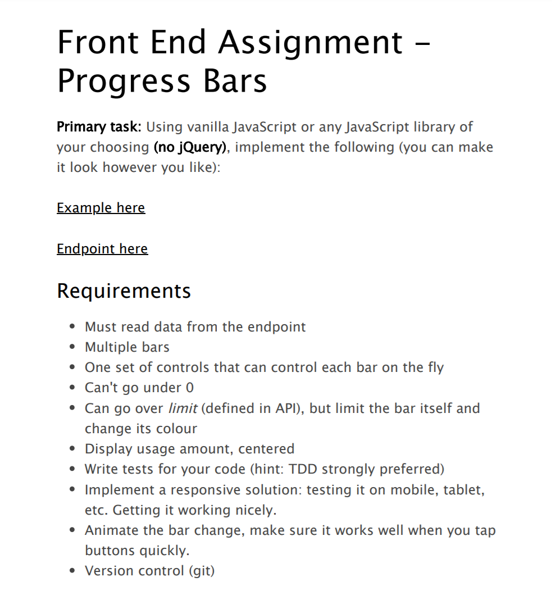
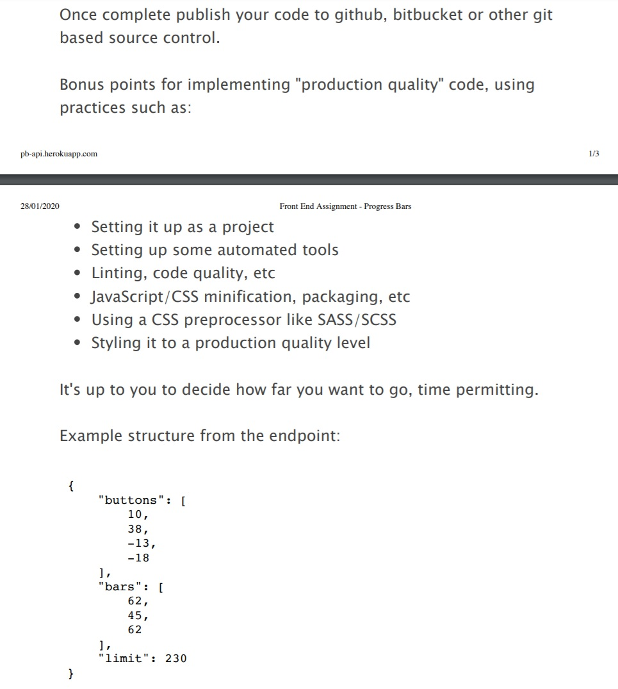
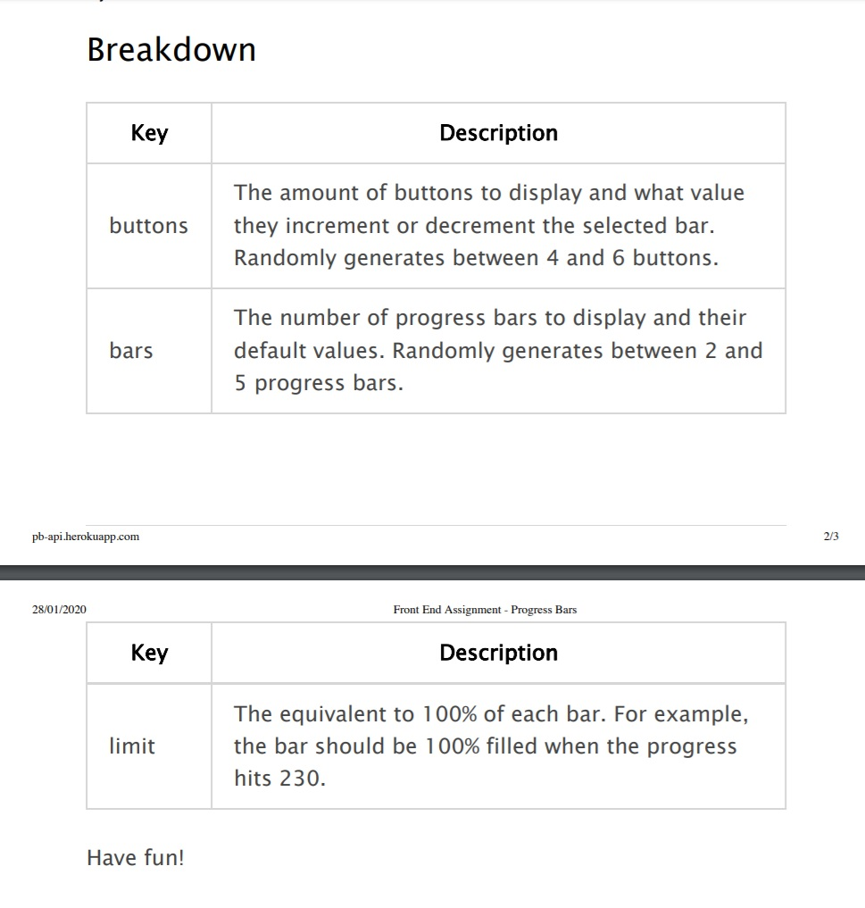

# ProgressBars-Task
Progress bars controlled by their respective buttons.

## Setup

To install all node modules run `yarn install`

To run it on **localhost** in development mode run `yarn run start:dev`

To Format code according to Prettier rules run `yarn run format`

To resolve code errors or warnings that can later cause bugs run `yarn run eslint-fix`.

To run all jest tests run `yarn test`

To use as production mode, run `yarn run start:prod`

For production build, run `yarn run build`

## Live Demo

[ProgressBars Live Demo](https://elastic-hugle-0f659b.netlify.com/)

## Task Requirements

